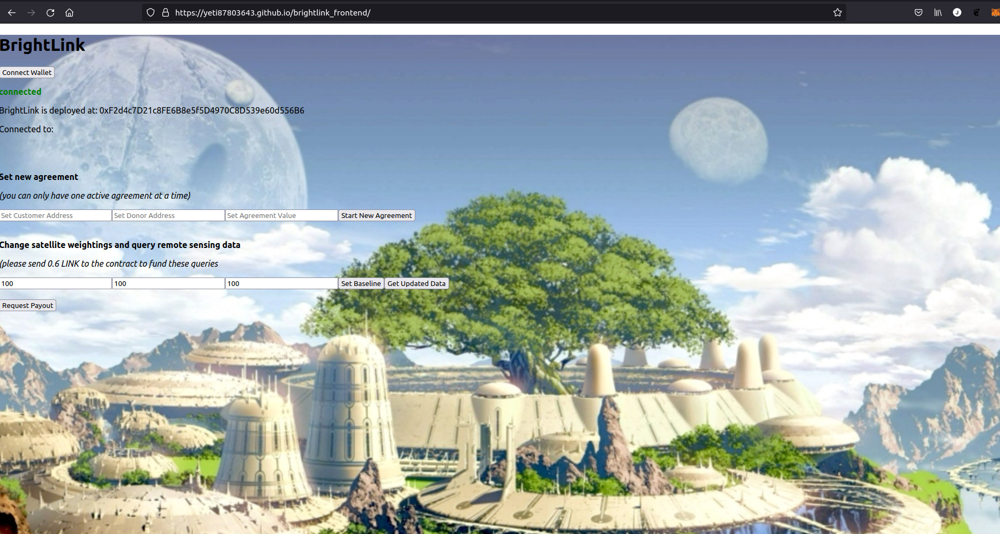

# blockchain-developer-bootcamp-final-project

# Urban-Greening app
## Satellite-verified greening of urban environments

This app will allow donors to escrow money in a smart contract as an incentive for a community to "green" a target area. Greening can include rooftop gardens, planting on verges and scrub-land, reforesting, etc. The donated funds are paid out if, and only if, the target area is demonstrably greener after a set time has elapsed. This is measured using satellite remote sensing. Multispectral sensors onboard NASA'a MODIS and LANDSAT and ESA's Sentinel-2 platforms have sufficient spectral resolution to detect chlorophyll using its reflectance signature. Chlorophyll is unique to photosynthetic plants and algae, and is therefore diagnostic of added vegetation in an urban environment. Using the chlorophyll index prtects against communities gaming the system by layign astroturf or painting surfaces green, and also enables expansion of the term "greening" to include improving the health of existing vegetation as well as adding more, since healthier plants produce more chlorophyll.

To achieve this, a financial model will be encoded in a Solidity smart contract and deployed to an Ethereum testnet (kovan). A donor will deposit funds into the contract along with a target change in chlorophyll index and an address for the payee. For example, a donor might say that 10,000 DAI is available if a community manages to green by 10% above its baseline. The basline chlorophyll index for a target area will be determined by making an external call through a Chainlink oracle to three bespoke Google Earth Engine apps hosted as serverless functions on a cloud server (likely MS Azure). This will accept polygon coordinates for the target area, start and end times as arguments and will return the area-averaged chlorophyll index averaged over the given dates (eg. the mean for the 3 most recent summers) as a uint. This will act as the threshold for determining a payout later. After a set time, the contract will trigger the chainlink oracle a second time t gather updated measurements. If the difference between initial and final measurements exceeds the given threshold, the payee automatically receives the donated funds. If not, the funds are returned to the donor. In the mean time, the ntract deposits the funds in an Aave lending pool where it accrues yield. That yield is kept as profit for the platform.

### Mechanism

The contract contains a function that triggers a Chainlink oracle to make a GET request to an API endpoint. That API endpoint is a json file that contains the results of a satellite remote sensing script run externally. When the remote sensing script finishes executing it updates the json file with the most recent remote sensing data. On request, the chainlink oracle ingests that data into the smart contract. This happens twice - first to establish an initial baseline which becomes the target value for the consumer organization to try to beat. Then, after some predetermined time has passed, the contract is called again and the updated remote sensing data is used to determine the amount of DAI that should be removed from the Aave pool and paid out. 

### Remote Sensing

For the community greening project the remote sensing scripts use Google Earth Engine to calculate the normalised-difference vegetation index for the given area on the given dates. This is done using three separate data sources from three different satellites (Landsat, MODIS, Sentinel-2). For each dataset, the ndvi is averaged (arithmetic mean) over time and space to give a single value for the ndvi of the region for the given time period. The three values (one from each satellite) are each pulled onchain by a chainlink oracle using the weighted mean. By default, the three satellites are equally weighted, but the contract owner can update this as necessary (.e.g if the lower resolution of MODIS gives less confidence, if one dataset has more cloudy images, etc).

## Public URL

The public-facing front-end for this project is at "https://yeti87803643.github.io/blockchain-developer-bootcamp-final-project/". Here, a user can connect using MetaMask and interact with the contract.

## MOCKING

Ths app currently requires Google Earth Engine login credentials to update the vegetation index for a given location. Therefore, for this submission I decided to mock the API endpoints queried by the Chainlink oracles. They stay constant and therefore a payout should be returned to the donor rather than awarded to the customer in this version of the system (there is another version, closer to production, for which this is not the case, at www.github.com/jmcook1186/Brightlink) but I reasoned that this version wouold be harder to evaluate for the bootcamp as it currently has awkward dependencies that I was not able to resolve before the submission deadline. 

## Instructions

1) start a brownie console connected to kovan and approve dai spending from the donor account
2) `dai.approve(contract.address,amount in wei, {"from":donor address})
3) make sure the connected wallet is open in metamask when the confirm button is clicked
4) click "documentation" in upper left corner for more information